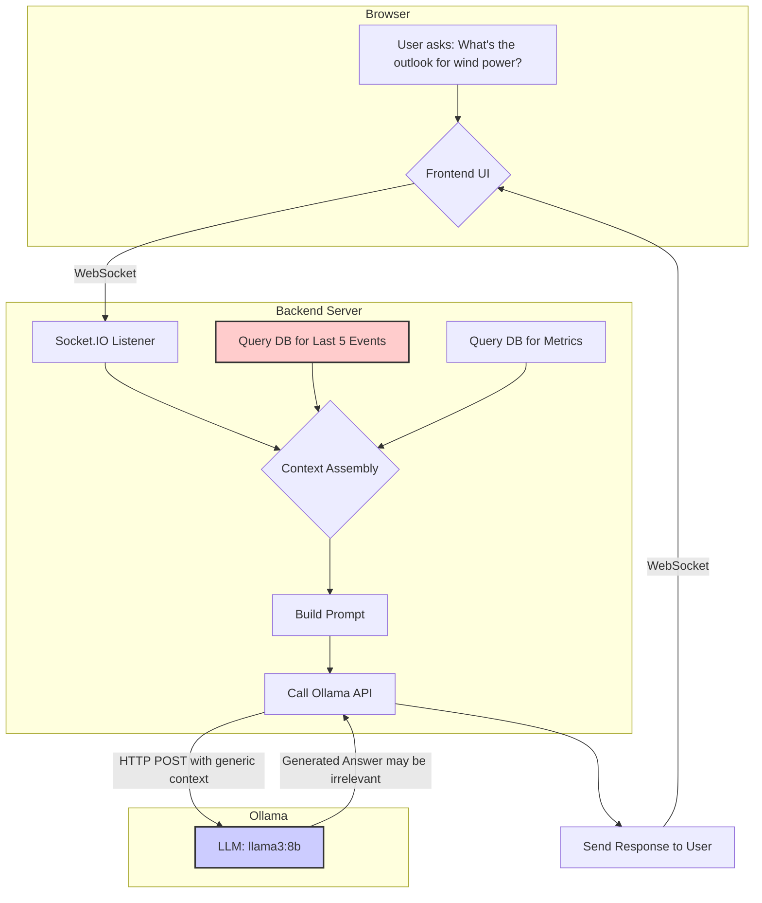
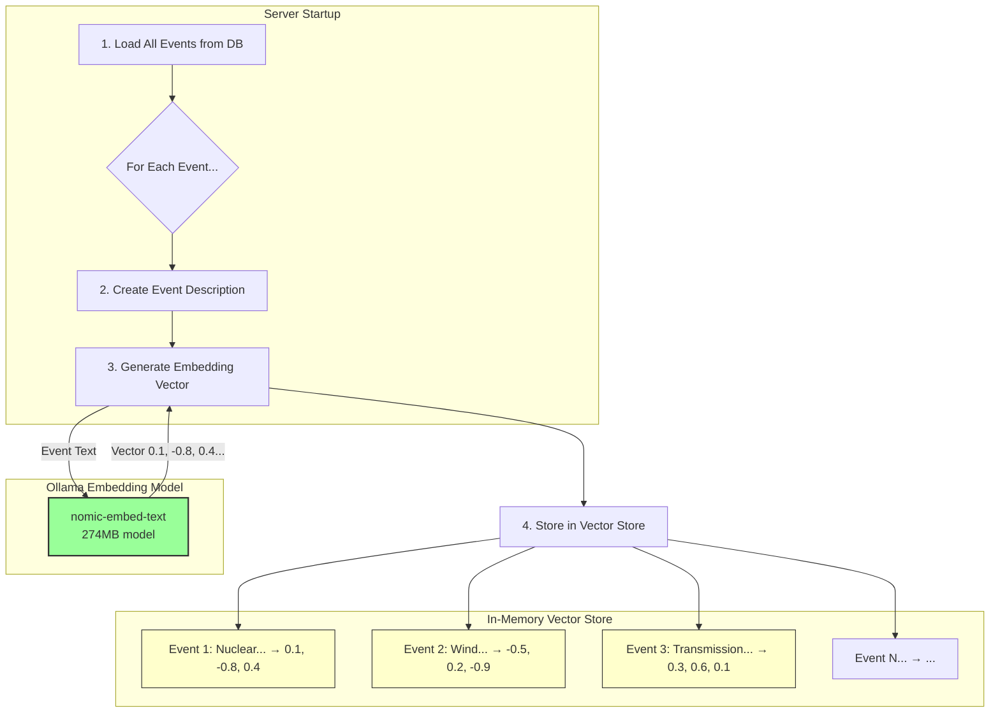
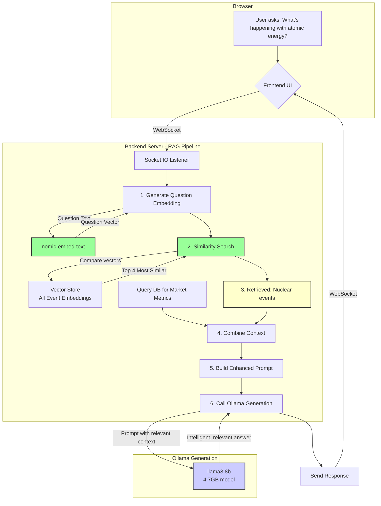
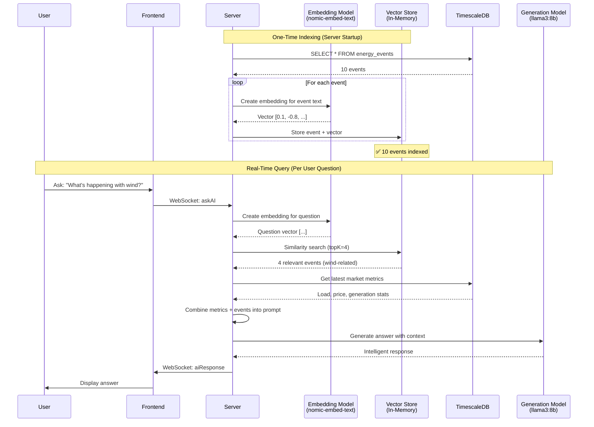

# RAG System Architecture Diagrams

## Current Implementation (Before RAG)



**Problem:** The "Last 5 Events" are completely disconnected from the user's question. The LLM gets irrelevant context.

---

## New RAG Implementation

### Phase 1: Indexing (One-time setup)



### Phase 2: Retrieval (Real-time per question)



---

## Semantic Understanding Example

### How RAG Understands "Atomic Energy" = "Nuclear Power"

```
User Question: "What's happening with atomic energy?"
                      ↓
            [Embedding Model]
                      ↓
Question Vector: [0.12, -0.78, 0.42, 0.31, ...]
                      ↓
         [Cosine Similarity Search]
                      ↓
Compare with all event vectors:

Event: "Nuclear Reactor Maintenance..."
Vector: [0.11, -0.79, 0.43, 0.30, ...]
Similarity Score: 0.95 ✅ MATCH!

Event: "Wind Farm Capacity Increase..."
Vector: [-0.52, 0.18, -0.88, 0.12, ...]
Similarity Score: 0.12 ❌ No match

Event: "Coal Plant Outage..."
Vector: [0.08, -0.21, 0.15, 0.42, ...]
Similarity Score: 0.42 ❌ No match
                      ↓
        Return top 4 matches
```

---

## Complete Data Flow



---

## Key Benefits Illustrated

### Before RAG
```
Question: "Wind power outlook?"
         ↓
Context: [Last 5 events]
  1. Nuclear maintenance ❌
  2. Transmission issue ❌
  3. Price spike ❌
  4. Coal outage ❌
  5. Hydro levels ❌
         ↓
LLM Answer: Generic, possibly incorrect
```

### After RAG
```
Question: "Wind power outlook?"
         ↓
Semantic Search → Find wind-related events
         ↓
Context: [Relevant events]
  1. Low wind period expected ✅
  2. High wind forecast Finland ✅
  3. Offshore wind farm online ✅
  4. Wind capacity increase ✅
         ↓
LLM Answer: Specific, data-driven, accurate
```
